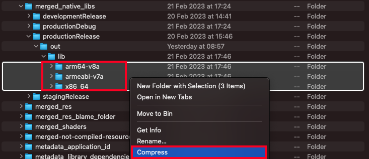
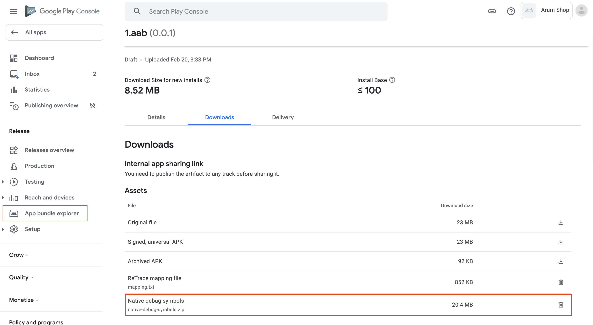
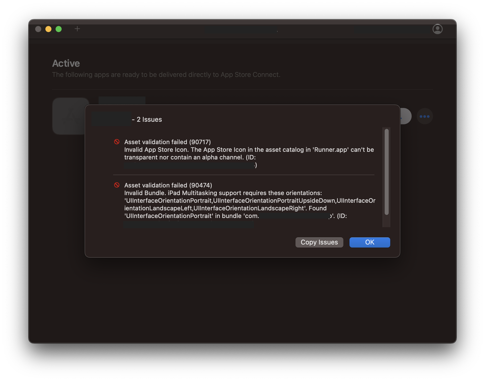
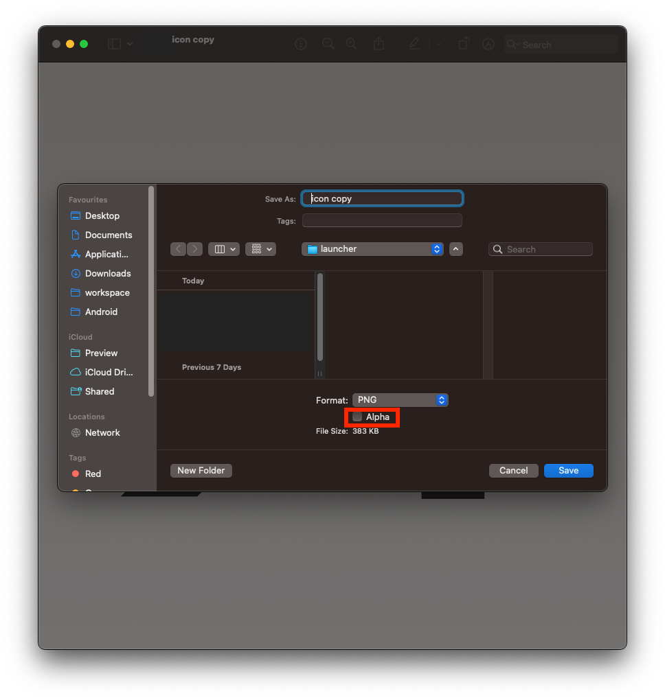
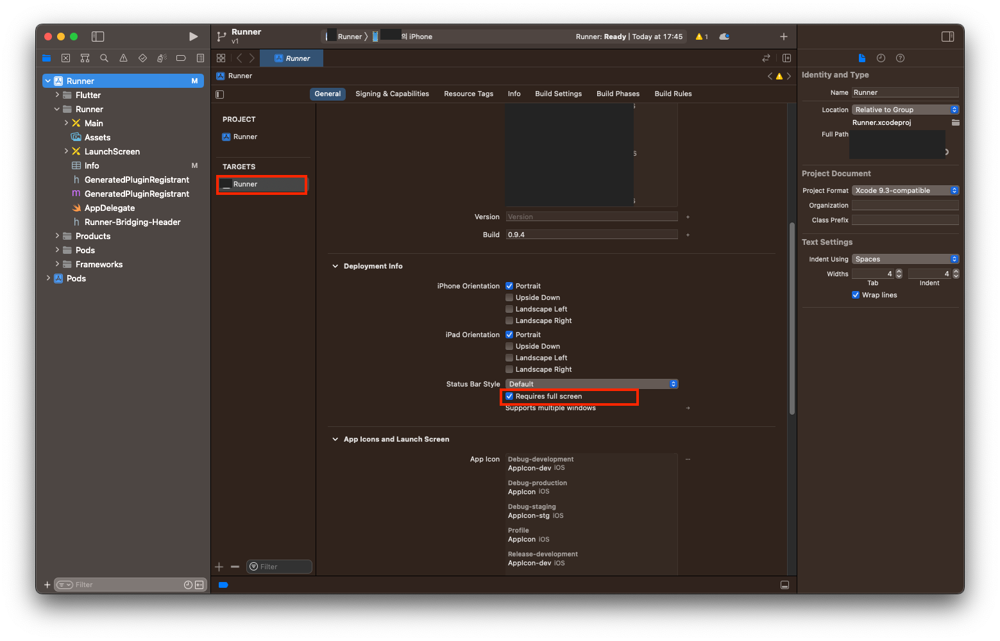
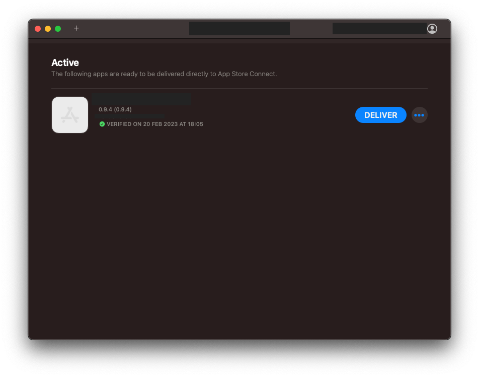
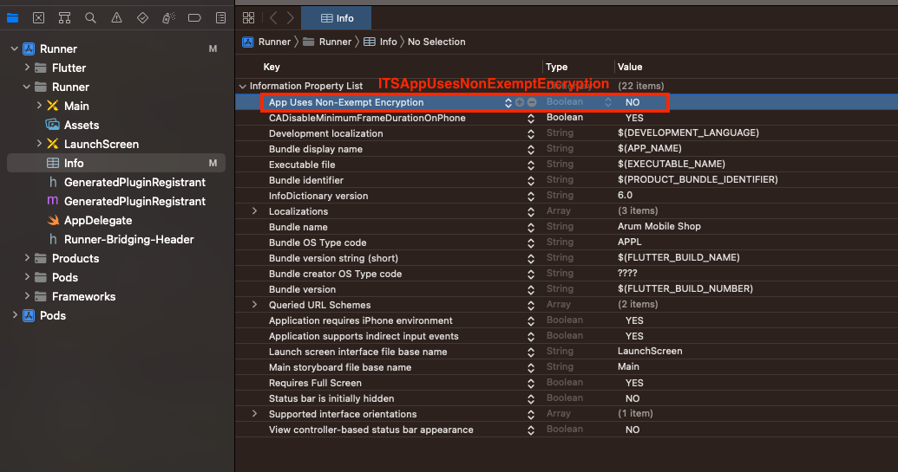

# Ready to deploy

## 1. Android
```
android {
    ...
    buildTypes {
        release {
            shrinkResources true
            minifyEnabled true
            proguardFiles getDefaultProguardFile('proguard-android.txt'),
                'proguard-rules.pro'
        }
    }
}
```

```sh
flutter build appbundle --release lib/main_production.dart --flavor production
```

- To generate key on mac silicon device, you need to download java first.
```sh
brew install java
sudo ln -sfn /opt/homebrew/opt/openjdk/libexec/openjdk.jdk /Library/Java/JavaVirtualMachines/openjdk.jdk
echo 'export PATH="/opt/homebrew/opt/openjdk/bin:$PATH"' >> ~/.zshrc
export CPPFLAGS="-I/opt/homebrew/opt/openjdk/include"
```
- Missing Symbol files


Compress the folders under "build/app/intermediates/merged_native_libs/productionRelease/out/lib".  

  


## 2. iOS
```sh
flutter build ipa --release lib/main_production.dart --flavor production --obfuscate --split-debug-info --export-method ad-hoc
```

### [**Upload the app bundle**](https://docs.flutter.dev/deployment/ios#upload-the-app-bundle-to-app-store-connect)

Once the app bundle is created, upload it to App Store Connect by either:
1) Install and open the [Apple Transport macOS app](https://apps.apple.com/us/app/transporter/id1450874784). Drag and drop the build/ios/ipa/*.ipa app bundle into the app.
2) Or upload the app bundle from the command line by running:
3) Or open build/ios/archive/MyApp.xcarchive in Xcode.


- [Transport macOS](https://apps.apple.com/us/app/transporter/id1450874784)






- AppStore Connect : Missing compliance




### [**Test flight**](https://testflight.apple.com/)
Tester can redeem with a code sended by the registered email and download on any devices.


## Refs.
1) Android/iOS obfuscation
   - https://stackoverflow.com/questions/62568757/playstore-error-app-bundle-contains-native-code-and-youve-not-uploaded-debug
   - https://support.google.com/googleplay/android-developer/answer/9848633?hl=en#zippy=%2Cupload-files-using-play-console
   - https://yagom.net/forums/topic/%EC%95%B1-%EC%82%AC%EC%9D%B4%EC%A6%88-%EC%A4%84%EC%9D%B4%EA%B8%B0/
2) iPad multitasking issue - Transporter
   - https://developer.apple.com/forums/thread/19215
   - https://stackoverflow.com/questions/32559724/ipad-multitasking-support-requires-these-orientations/32728607#32728607
3) Alpha channel remove
   - https://stackoverflow.com/questions/46585809/error-itms-90717-invalid-app-store-icon
4) Missing compliance
   - https://medium.com/@iamCoder/how-to-solve-missing-compliance-status-in-testflight-and-invites-not-coming-to-testers-4cbbe3c4ed12
