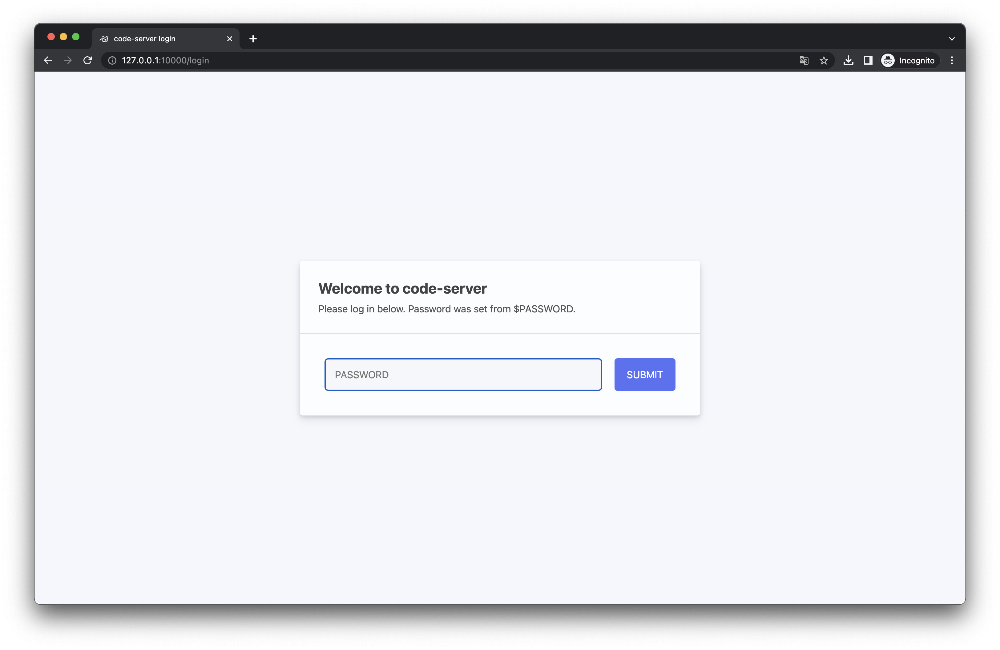
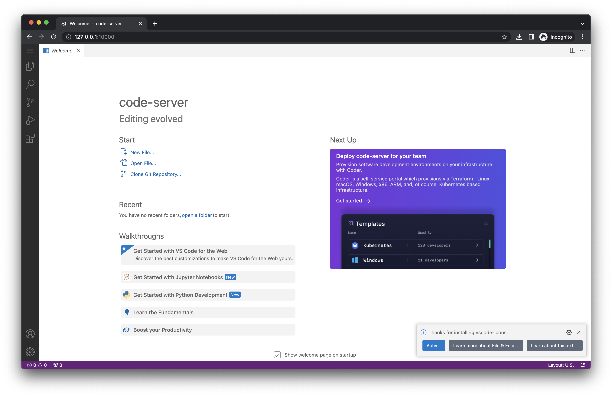
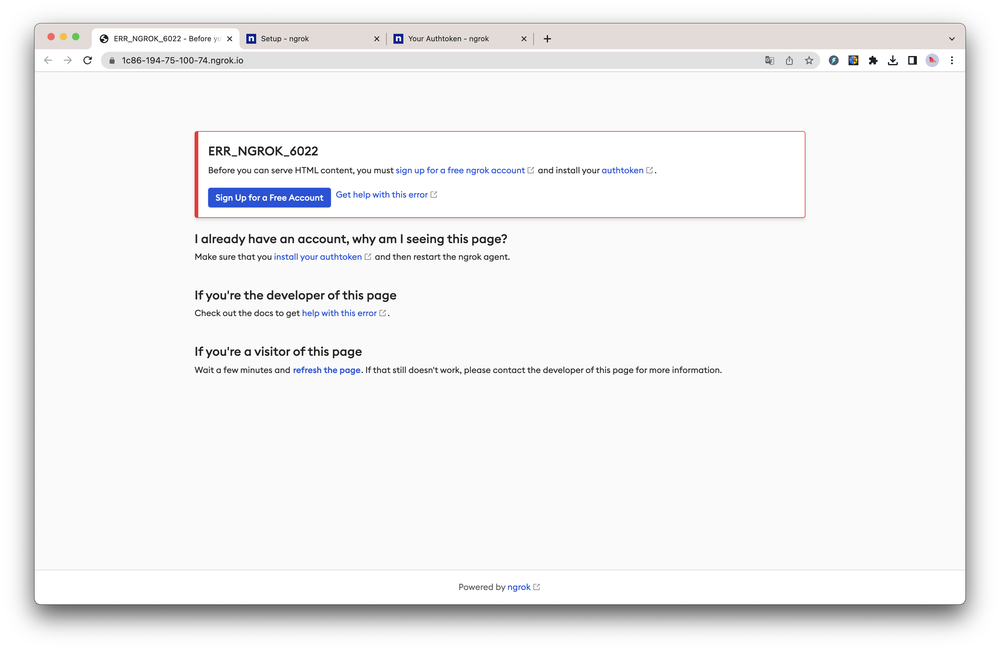
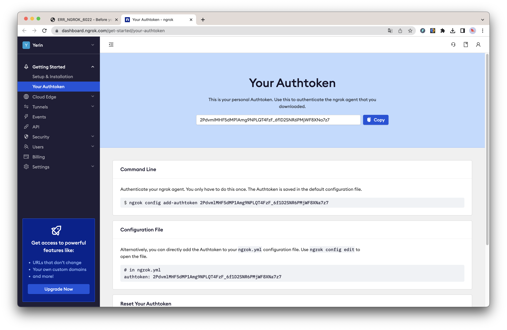
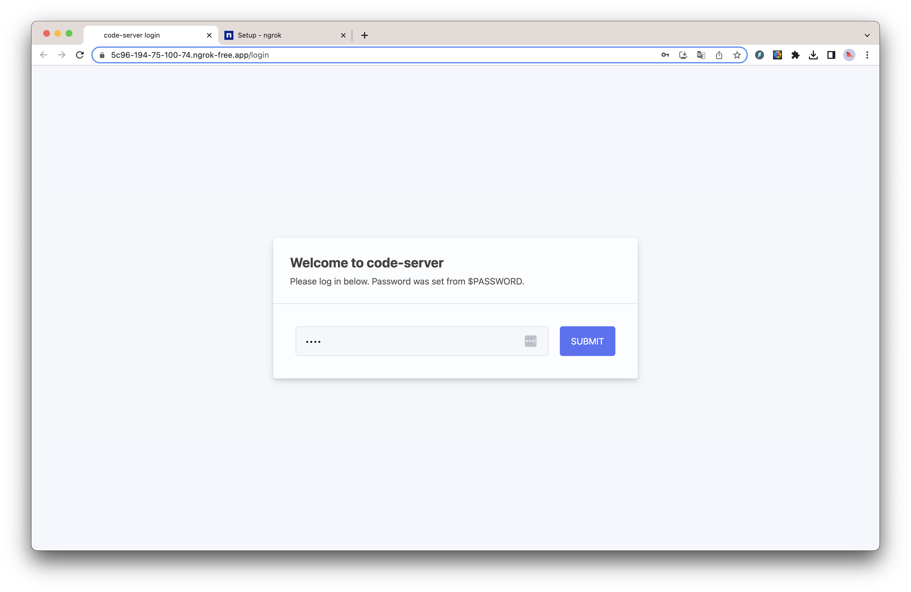

# colab + vscode

## Environment

- macOS 13
- Python 3.11.0
- pip 21.2.4

## Installation Colab with python lib import

### Concept


### Colab Installations

```sh
$ pip3 install colabcode
```

Create a new file `colab_getting_started.py`:

```python
from colabcode import ColabCode

ColabCode(port=10000, password="12345", mount_drive=True)
```

Run the file:

```sh
$ python3 colab_getting_started.py

--2023-05-10 17:58:32--  https://code-server.dev/install.sh
Resolving code-server.dev (code-server.dev)... 104.21.16.171, 172.67.214.225
Connecting to code-server.dev (code-server.dev)|104.21.16.171|:443... connected.
HTTP request sent, awaiting response... 302 Found
Location: https://raw.githubusercontent.com/cdr/code-server/main/install.sh [following]
--2023-05-10 17:58:33--  https://raw.githubusercontent.com/cdr/code-server/main/install.sh
Resolving raw.githubusercontent.com (raw.githubusercontent.com)... 185.199.108.133, 185.199.109.133, 185.199.110.133, ...
Connecting to raw.githubusercontent.com (raw.githubusercontent.com)|185.199.108.133|:443... connected.
HTTP request sent, awaiting response... 200 OK
Length: 15858 (15K) [text/plain]
Saving to: ‘install.sh’

install.sh                                           100%[=====================================================================================================================>]  15.49K  --.-KB/s    in 0.001s

2023-05-10 17:58:33 (11.7 MB/s) - ‘install.sh’ saved [15858/15858]

[2023-05-10T16:58:52.675Z] info  Wrote default config file to ~/.config/code-server/config.yaml
Installing extensions...
Installing extension 'ms-python.python'...
Extension 'ms-python.python' v2023.6.1 was successfully installed.
Installing extensions...
Extension 'ms-toolsai.jupyter' v2023.3.100 is already installed. Use '--force' option to update to latest version or provide '@<version>' to install a specific version, for example: 'ms-toolsai.jupyter@1.2.3'.
Installing extensions...
Installing extension 'mechatroner.rainbow-csv'...
Extension 'mechatroner.rainbow-csv' v3.3.0 was successfully installed.
Installing extensions...
Installing extension 'vscode-icons-team.vscode-icons'...
Extension 'vscode-icons-team.vscode-icons' v12.4.0 was successfully installed.
t=2023-05-10T17:59:15+0100 lvl=warn msg="ngrok config file found at legacy location, move to XDG location" xdg_path="/Users/xxx/Library/Application Support/ngrok/ngrok.yml" legacy_path=/Users/xxx/.ngrok2/ngrok.yml
Code Server can be accessed on: NgrokTunnel: "https://69ca-194-75-100-74.ngrok.io" -> "http://localhost:10000"
Unknown option: n
Unknown option: k
fuser: [-cfu] file ...
        -c      file is treated as mount point
        -f      the report is only for the named files
        -u      print username of pid in parenthesis
[2023-05-10T16:59:16.781Z] info  code-server 4.12.0 1da7cda39e54faa087cf129f0f85d4d4e63e81b8
[2023-05-10T16:59:16.782Z] info  Using user-data-dir ~/.local/share/code-server
[2023-05-10T16:59:16.789Z] info  Using config file ~/.config/code-server/config.yaml
[2023-05-10T16:59:16.789Z] info  HTTP server listening on http://127.0.0.1:10000/
[2023-05-10T16:59:16.789Z] info    - Authentication is enabled
[2023-05-10T16:59:16.789Z] info      - Using password from $PASSWORD
[2023-05-10T16:59:16.789Z] info    - Not serving HTTPS
```

Open the URL in your browser:




### Ngrok Setup

You might meet the following error:



To fix this, you need to setup auth token:



```sh
$ ngrok config add-authtoken <your_auth_token>
Authtoken saved to configuration file: /Users/xxx/.ngrok2/ngrok.yml

# Check the config file
$ cat /Users/xxx/.ngrok2/ngrok.yml
region: us
version: '2'
authtoken: <your_auth_token>
```

Restart the colab server:



---

## Installation Colab with Conda

### [Conda install shells](https://repo.anaconda.com/miniconda/)

```sh
$ wget https://repo.anaconda.com/miniconda/Miniconda3-latest-MacOSX-arm64.sh
$ chmod +x Miniconda3-latest-MacOSX-arm64.sh
$ ./Miniconda3-latest-MacOSX-arm64.sh

Welcome to Miniconda3 py310_23.3.1-0

In order to continue the installation process, please review the license
agreement.
Please, press ENTER to continue
>>>
======================================
End User License Agreement - Miniconda
======================================
...
Please answer 'yes' or 'no':'
>>> yes

Miniconda3 will now be installed into this location:
/Users/xxx/miniconda3

  - Press ENTER to confirm the location
  - Press CTRL-C to abort the installation
  - Or specify a different location below

[/Users/xxx/miniconda3] >>>
PREFIX=/Users/xxx/miniconda3
Unpacking payload ...
...
by running conda init? [yes|no]
[yes] >>> yes
no change     /Users/xxx/miniconda3/condabin/conda
no change     /Users/xxx/miniconda3/bin/conda
no change     /Users/xxx/miniconda3/bin/conda-env
no change     /Users/xxx/miniconda3/bin/activate
no change     /Users/xxx/miniconda3/bin/deactivate
no change     /Users/xxx/miniconda3/etc/profile.d/conda.sh
no change     /Users/xxx/miniconda3/etc/fish/conf.d/conda.fish
no change     /Users/xxx/miniconda3/shell/condabin/Conda.psm1
modified      /Users/xxx/miniconda3/shell/condabin/conda-hook.ps1
no change     /Users/xxx/miniconda3/lib/python3.10/site-packages/xontrib/conda.xsh
no change     /Users/xxx/miniconda3/etc/profile.d/conda.csh
modified      /Users/xxx/.zshrc

==> For changes to take effect, close and re-open your current shell. <==

If you'd prefer that conda's base environment not be activated on startup,
   set the auto_activate_base parameter to false:

conda config --set auto_activate_base false

Thank you for installing Miniconda3!
```

### Create and avtivate a new environment

```sh
$ conda create -y -n <env_name> python=3.11
$ conda activate <env_name>
```

### Install google colab

```sh
$ conda install -c conda-forge google-colab
```

### Activate your conda environment.

```sh
$ python -m ipykernel install --user --name=<env_name>
```

## Warnings

```sh
Installing collected packages: pip
  WARNING: The scripts pip, pip3, pip3.10 and pip3.9 are installed in '/Users/xxx/Library/Python/3.9/bin' which is not on PATH.
  Consider adding this directory to PATH or, if you prefer to suppress this warning, use --no-warn-script-location.
Successfully installed pip-23.1.2
WARNING: You are using pip version 21.2.4; however, version 23.1.2 is available.
You should consider upgrading via the '/Applications/Xcode.app/Contents/Developer/usr/bin/python3 -m pip install --upgrade pip' command.
```

I've seen this warning when installing `pip` with `pip3`. And it's because the `pip` executable is installed in a directory that is not on your `PATH`.
There are three duplicate `pip` executables installed on my system:

- /opt/homebrew/bin/python3
- /Users/xxx/Library/Python/3.9/bin
- /Applications/Xcode.app/Contents/Developer/usr/bin/python3

If you see this warning, you can add the following to your `~/.zshrc` file:

```sh
export PATH="/opt/homebrew/bin/python3:$PATH"
```

## References

1. https://towardsdatascience.com/colabcode-deploying-machine-learning-models-from-google-colab-54e0d37a7b09
2. https://medium.com/analytics-vidhya/colab-vs-code-github-jupyter-perfect-for-deep-learning-2b257ae94d01
