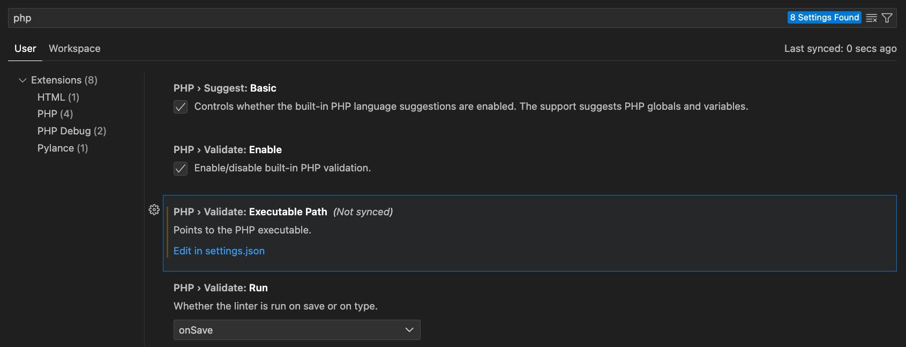
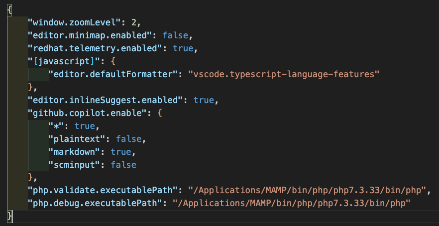
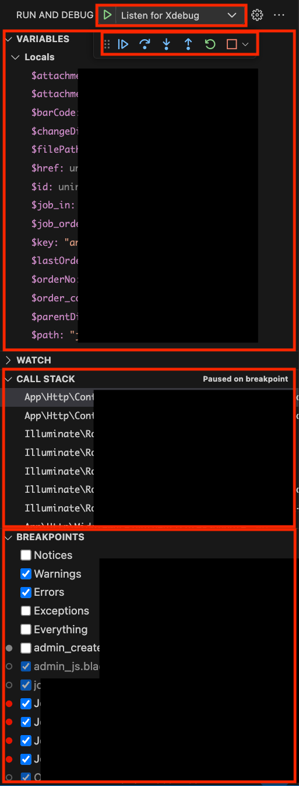
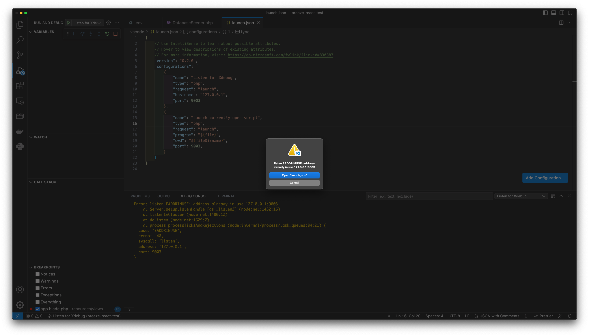

## 1. Laravel Debugbar

### 1.1 Add requirement
```sh
$ php composer.phar require barryvdh/laravel-debugbar --dev
```

### 1.2 Change config
```php
diff --git a/config/app.php b/config/app.php
index 3c5820c4..8ddaee54 100644
--- a/config/app.php
+++ b/config/app.php
@@ -200,6 +200,10 @@ return [
 
         App\Providers\GoogleDriveServiceProvider::class,
 
+        /*
+         * Laravel Debugbar
+         */
+        Barryvdh\Debugbar\ServiceProvider::class,
     ],
 
     /*
@@ -258,6 +262,10 @@ return [
         'Excel'        => Maatwebsite\Excel\Facades\Excel::class,
         'PDF'          => Barryvdh\DomPDF\Facade::class,
 
+        /*
+         * Debugbar Aliases
+         */
+        'Debugbar'     => Barryvdh\Debugbar\Facade::class,
     ],
 
 ];
```

### 1.3 Publish
```sh 
$ php artisan vendor:publish --provider="Barryvdh\Debugbar\ServiceProvider"
```

### 1.4 Check `.env`
```ini
APP_DEBUG=true
```

### 1.5 Clear cache & config
```sh
$ php artisan cache:clear
$ php artisan config:cache
```

## 2. Xdebug + VS code + macOS + MAMP
### 2.1 Install Xdebug extension on VSCode
```sh
pecl install xdebug
```
But if you use MAMP, you don't need to install xdebug via pecl since MAMP already has xdebug.so file.
xdebug.so path: `/Applications/MAMP/bin/php/php7.3.33/lib/php/extensions/no-debug-non-zts-20180731/xdebug.so`   

### 2.2 Add the below code on php.ini
1. PHP 8.2  
php.ini path: `/opt/homebrew/etc/php/8.2/php.ini`   
```ini
[xdebug]
zend_extension="/opt/homebrew/Cellar/php/8.2.10/pecl/20220829/xdebug.so"
xdebug.mode=debug
xdebug.log=/tmp/xdebug.log
xdebug.client_host=127.0.0.1
xdebug.client_port=9003
xdebug.discover_client_host=true
xdebug.start_with_request=yes
xdebug.remote_handler=dbgp
```

2. PHP 7.3  
php.ini path: `/Applications/MAMP/bin/php/php7.3.33/conf/php.ini`   
```ini
[xdebug]
zend_extension="/Applications/MAMP/bin/php/php7.3.33/lib/php/extensions/no-debug-non-zts-20180731/xdebug.so"
xdebug.mode = debug$
xdebug.log = /tmp/xdebug.log$
xdebug.client_port = 9003
xdebug.remote_enable=1
xdebug.remote_host=127.0.0.1
xdebug.remote_connect_back=1
xdebug.remote_port=9003
xdebug.remote_handler=dbgp
xdebug.remote_mode=req
```

### 2.3 VS settings   
PHP settings.json   

- Add php executable path: `/Applications/MAMP/bin/php/php7.3.33/bin/php`   

```json
"php.validate.executablePath": "/Applications/MAMP/bin/php/php7.3.33/bin/php",
"php.debug.executablePath": "/Applications/MAMP/bin/php/php7.3.33/bin/php"
```

VS launch.json
```json
{
    // Use IntelliSense to learn about possible attributes.
    // Hover to view descriptions of existing attributes.
    // For more information, visit: https://go.microsoft.com/fwlink/?linkid=830387
    "version": "0.2.0",
    "configurations": [
        {
            "name": "Listen for Xdebug",
            "type": "php",
            "request": "launch",
            "hostname": "127.0.0.1",
            "port": 9003
        },
        {
            "name": "Launch currently open script",
            "type": "php",
            "request": "launch",
            "program": "${file}",
            "cwd": "${fileDirname}",
            "port": 9003,
        }
    ]
}
```

### 2.4 Run Xdebug on VSCode
1. Run server on MAMP
2. Run Xdebug on VSCode
3. Set breakpoint on VSCode
4. Access to the page on browser
5. VSCode will stop on breakpoint
6. You can check the variable on VSCode


### 2.5 Troubleshooting 1: Already used port



1. Find the process which uses the port 9003

```bash
$ netstat -anv | grep 9003
tcp4       0      0  127.0.0.1.9003         127.0.0.1.49477        ESTABLISHED  408157  146988   1291      0 00102 00000004 0000000000002cb7 00000081 01000900      1      0 000001
tcp4       0      0  127.0.0.1.49477        127.0.0.1.9003         ESTABLISHED  408193  146988    864      0 00102 00000000 0000000000002cb6 00000081 00000900      1      0 000001
tcp4       0      0  127.0.0.1.9003         *.*                    LISTEN       131072  131072   1291      0 00000 00000006 0000000000002c7a 000000           0 c53d8
```

2. Kill the process

```bash
$ kill 864
$ kill 1291
```
$ kill -9 408157
$ kill -9 408193

### 2.6 Troubleshooting 2: php command is so slow
```bash
$ php -v
PHP 7.3.33 (cli) (built: May  6 2021 11:30:56) ( NTS )
$ cat test.php
 <?php
 echo 'test';
 ?>
$ time /Applications/MAMP/bin/php/php7.3.33/bin/php test.php
test/Applications/MAMP/bin/php/php7.3.33/bin/php test.php  0.31s user 0.11s system 80% cpu 0.428 total
```

#### 2.6.1 Solution 1: Disable xdebug
1. PHP 8.2
```bash
$ vi /opt/homebrew/etc/php/8.2/php.ini
```
```ini
[xdebug]
;zend_extension="/opt/homebrew/Cellar/php/8.2.10/pecl/20220829/xdebug.so"
;xdebug.mode=debug
;xdebug.log=/tmp/xdebug.log
;xdebug.client_host=127.0.0.1
;xdebug.client_port=9003
;xdebug.discover_client_host=true
;xdebug.start_with_request=yes
;xdebug.remote_handler=dbgp
```

2. PHP 7.3
```bash
$ vi /Applications/MAMP/bin/php/php7.3.33/conf/php.ini
```
```ini
[xdebug]
;zend_extension="/Applications/MAMP/bin/php/php7.3.33/lib/php/extensions/no-debug-non-zts-20180731/xdebug.so"
;xdebug.mode = debug$
;xdebug.log = /tmp/xdebug.log$
;xdebug.client_port = 9003
;xdebug.remote_enable=1
;xdebug.remote_host=
;xdebug.remote_connect_back=1
;xdebug.remote_port=9003
;xdebug.remote_handler=dbgp
;xdebug.remote_mode=req
```

```bash
$ time /Applications/MAMP/bin/php/php7.3.33/bin/php test.php
test/Applications/MAMP/bin/php/php7.3.33/bin/php test.php  0.03s user 0.01s system 80% cpu 0.049 total
```

## References
- https://medium.com/@alirazalilani/debugging-php-laravel-with-visual-studio-code-37b756fb6c19/
- https://5balloons.info/setting-up-xdebug-using-laravel-valet-and-vscode/

