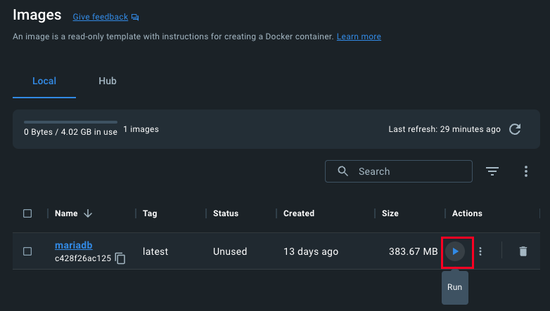
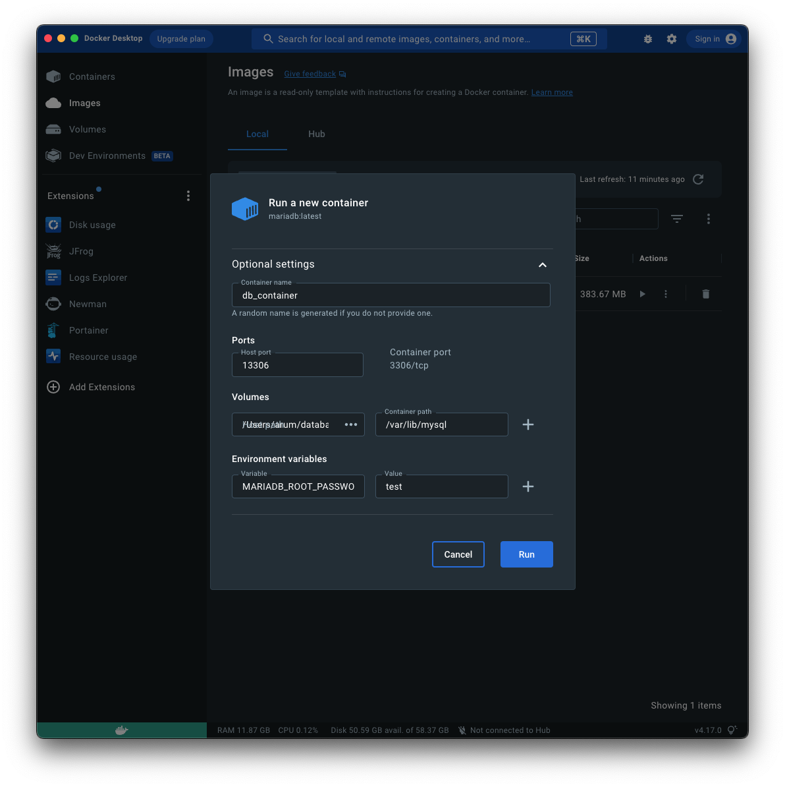
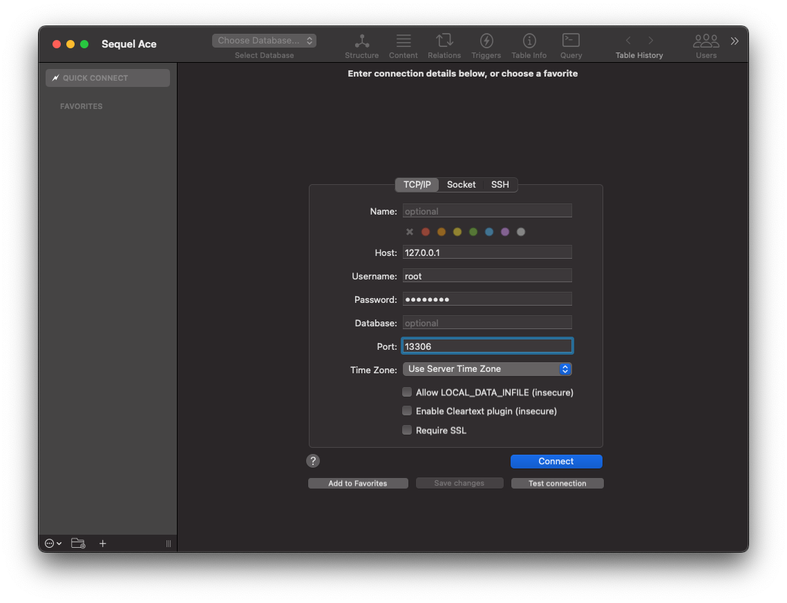

# Docker CLI

## Create a container

```sh
docker create [image]
```

## Start a container

```sh
docker start [name|image]
```

## Create and start a container

```sh
$ docker run [image]
```

```sh
docker run \
   -i \                                # Keep STDIN open even if not attached (To use keyboard)
   -t \                                # Allocate a pseudo-TTY (To use Terminal)
   --rm \                              # Automatically remove the container when it exits
   -d \                                # Run container in background and print container ID
   --name string \                     # Assign a name to the container
   -p 13306:3306                          # Publish a container's port(s) to the hos
   -v /opt/example:/example \          # Bind mount a volume
   IMAGE \                             # Image
   [COMMAND]                           # Command in the container
```

-it == -i -t

## Check the running container

```sh
docker ps
```

## Check the status of all running container

```sh
docker ps -a
```

## Check the detail of the container

```sh
$ docker inspect [container]
```

## Pause the container

```sh
$ docker pause [container]
```

## Resume the container

```sh
$ docker unpause [container]
```

## Stop the container (Pass SIGTERM)

```sh
$ docker stop [container]
```

## Stop all container

```sh
$ docker stop $(docker ps -a -q)
```

## Kill the container (Pass SIGKILL)

```sh
$ docker kill [container]
```

## Remove the container

```sh
$ docker rm [container]
```

## Remove the container after running

```sh
$ docker run --rm ...
```

## Remove the container after kill (Pass SIGKILL)

```sh
$ docker rm -f [container]
```

## Remove all stopped container

```sh
$ docker container prune
```

# Running and Connecting Maria DB docker

I've used Docker Desktop on macOS silicon.

```sh
docker pull mariadb
```




