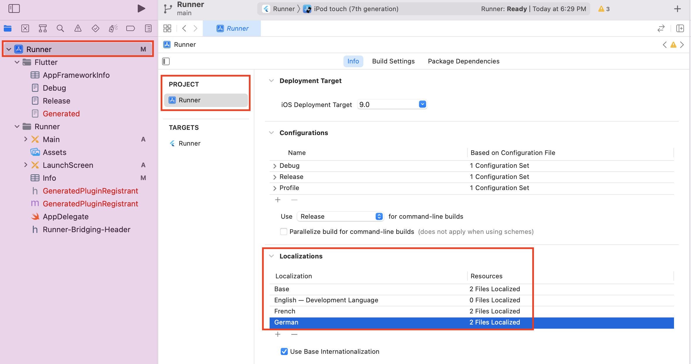
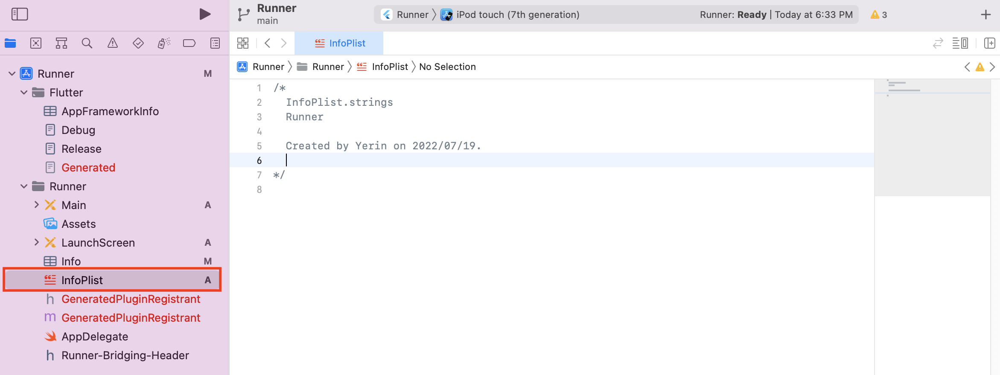
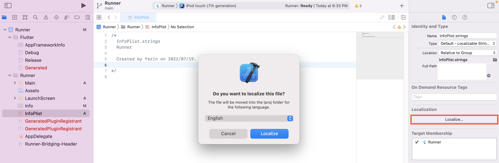
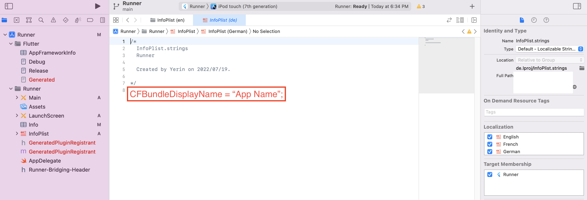

# Flutter Localization packages

- [flutter_localizations](https://docs.flutter.dev/development/accessibility-and-localization/internationalization)
- [intl](https://pub.dev/packages/intl)
- [easy_localization](https://pub.dev/packages/easy_localization)

There are packages for flutter app localization a lot. Just pick one!
But if you want to change app name with system preferences, you should change the native code.

# Android

1. Change android:label in AndroidManifest.xml
   ${FlutterProj}/android/app/src/main/AndroidManifest.xml

```xml
 <manifest xmlns:android="http://schemas.android.com/apk/res/android"
    package="com.yerin.xxxx">
   <application
-        android:label="xxxx"
+        android:label="@string/app_name"
        android:name="${applicationName}"
        android:icon="@mipmap/ic_launcher">
        <activity
        ...
```

2. Create strings files
   ${FlutterProj}/android/app/src/main/res/values-en/strings.xml
or
${FlutterProj}/android/app/src/main/res/values-de/strings.xml

3. Write your app name down!

```xml
<resources>
    <string name="app_name">APP NAME</string>
</resources>
```

# iOS

1. Open Xcode!
   In ios folder, there is Xcode file which has `xcodeproj` extension.
   **Remember! If you don't create strings with Xcode, that files couldn't add properly into the project.**

2. Add languages what you want to support.
   

3. Create InfoPlist.strings in Runner.
   

4. Create other strings file via clicking `localize` button.
   

5. Write your app name down!
   
