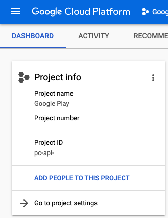

## Android codesign with github

https://docs.flutter.dev/deployment/android#signing-the-app

1. Create keystore
```shell
keytool -genkey -v -keystore ~/keystore.jks -keyalg RSA -keysize 2048 -validity 10000 -alias ${KEY_ALIAS}
Enter keystore password: ${KEY_STORE} 
Re-enter new password: ${KEY_STORE} 
What is your first and last name?
  []:  *
What is the name of your organizational unit?
  []:  dev 
What is the name of your organization?
  []:  *
What is the name of your City or Locality?
  []:  London
What is the name of your State or Province?
  []:  Greater London  
What is the two-letter country code for this unit?
  []:  UK
Is CN=*, OU=dev, O=*, L=London, ST=Greater London, C=UK correct?
  [no]:  yes

Generating 2,048 bit RSA key pair and self-signed certificate (SHA256withRSA) with a validity of 10,000 days
        for: CN=*, OU=dev, O=*, L=London, ST=Greater London, C=UK
Enter key password for <*>
        (RETURN if same as keystore password): ${KEY_PASSWORD} 
Re-enter new password: ${KEY_PASSWORD} 
[Storing keystore.jks]

Warning:
The JKS keystore uses a proprietary format. It is recommended to migrate to PKCS12 which is an industry standard format using "keytool -importkeystore -srckeystore keystore.jks -destkeystore keystore.jks -deststoretype pkcs12".
```

2. Base64 encoding
```shell
base64 ~/keystore.jks > keybase64.txt
```

3. Create github secrets


## Upload outputs to CGP

1. Install gcloud cli

```shell
google-cloud-sdk/install.sh
Welcome to the Google Cloud CLI!

To help improve the quality of this product, we collect anonymized usage data
and anonymized stacktraces when crashes are encountered; additional information
is available at <https://cloud.google.com/sdk/usage-statistics>. This data is
handled in accordance with our privacy policy
<https://cloud.google.com/terms/cloud-privacy-notice>. You may choose to opt in this
collection now (by choosing 'Y' at the below prompt), or at any time in the
future by running the following command:

    gcloud config set disable_usage_reporting false

Do you want to help improve the Google Cloud CLI (y/N)?  y


Your current Google Cloud CLI version is: 374.0.0
The latest available version is: 374.0.0

┌────────────────────────────────────────────────────────────────────────────────────────────────────────────┐
│                                                 Components                                                 │
├───────────────┬──────────────────────────────────────────────────────┬──────────────────────────┬──────────┤
│     Status    │                         Name                         │            ID            │   Size   │
├───────────────┼──────────────────────────────────────────────────────┼──────────────────────────┼──────────┤
│ Not Installed │ App Engine Go Extensions                             │ app-engine-go            │  4.0 MiB │
│ Not Installed │ Appctl                                               │ appctl                   │ 18.5 MiB │
│ Not Installed │ Cloud Bigtable Command Line Tool                     │ cbt                      │  8.1 MiB │
│ Not Installed │ Cloud Bigtable Emulator                              │ bigtable                 │  5.7 MiB │
│ Not Installed │ Cloud Datalab Command Line Tool                      │ datalab                  │  < 1 MiB │
│ Not Installed │ Cloud Datastore Emulator                             │ cloud-datastore-emulator │ 18.4 MiB │
│ Not Installed │ Cloud Firestore Emulator                             │ cloud-firestore-emulator │ 40.5 MiB │
│ Not Installed │ Cloud Pub/Sub Emulator                               │ pubsub-emulator          │ 60.7 MiB │
│ Not Installed │ Cloud SQL Proxy                                      │ cloud_sql_proxy          │  7.3 MiB │
│ Not Installed │ Google Cloud Build Local Builder                     │ cloud-build-local        │  6.2 MiB │
│ Not Installed │ Google Container Registry's Docker credential helper │ docker-credential-gcr    │          │
│ Not Installed │ Kustomize                                            │ kustomize                │  7.4 MiB │
│ Not Installed │ Minikube                                             │ minikube                 │ 26.1 MiB │
│ Not Installed │ Nomos CLI                                            │ nomos                    │ 23.6 MiB │
│ Not Installed │ On-Demand Scanning API extraction helper             │ local-extract            │ 12.9 MiB │
│ Not Installed │ Skaffold                                             │ skaffold                 │ 18.3 MiB │
│ Not Installed │ anthos-auth                                          │ anthos-auth              │ 18.0 MiB │
│ Not Installed │ config-connector                                     │ config-connector         │ 49.8 MiB │
│ Not Installed │ gcloud Alpha Commands                                │ alpha                    │  < 1 MiB │
│ Not Installed │ gcloud Beta Commands                                 │ beta                     │  < 1 MiB │
│ Not Installed │ gcloud app Java Extensions                           │ app-engine-java          │ 51.6 MiB │
│ Not Installed │ gcloud app PHP Extensions                            │ app-engine-php           │ 21.9 MiB │
│ Not Installed │ gcloud app Python Extensions                         │ app-engine-python        │  7.8 MiB │
│ Not Installed │ gcloud app Python Extensions (Extra Libraries)       │ app-engine-python-extras │ 26.4 MiB │
│ Not Installed │ kpt                                                  │ kpt                      │ 11.7 MiB │
│ Not Installed │ kubectl                                              │ kubectl                  │  < 1 MiB │
│ Not Installed │ kubectl-oidc                                         │ kubectl-oidc             │ 18.0 MiB │
│ Not Installed │ pkg                                                  │ pkg                      │          │
│ Installed     │ BigQuery Command Line Tool                           │ bq                       │  1.0 MiB │
│ Installed     │ Cloud Storage Command Line Tool                      │ gsutil                   │  8.1 MiB │
│ Installed     │ Google Cloud CLI Core Libraries                      │ core                     │ 22.3 MiB │
└───────────────┴──────────────────────────────────────────────────────┴──────────────────────────┴──────────┘
To install or remove components at your current SDK version [374.0.0], run:
  $ gcloud components install COMPONENT_ID
  $ gcloud components remove COMPONENT_ID

To update your SDK installation to the latest version [374.0.0], run:
  $ gcloud components update


Modify profile to update your $PATH and enable shell command completion?

Do you want to continue (Y/n)?  y

The Google Cloud SDK installer will now prompt you to update an rc file to bring
 the Google Cloud CLIs into your environment.

Enter a path to an rc file to update, or leave blank to use
[/Users/yerin/.zshrc]:  /Users/yerin/.zprofile
Backing up [/Users/yerin/.zprofile] to [/Users/yerin/.zprofile.backup].
[/Users/yerin/.zprofile] has been updated.

==> Start a new shell for the changes to take effect.


For more information on how to get started, please visit:
  https://cloud.google.com/sdk/docs/quickstarts

```

https://cloud.google.com/sdk/docs/install


2. Login and set via shell
```bash
~ gcloud auth login
Your browser has been opened to visit:

    https://accounts.google.com/o/oauth2/auth?response_type=code&client_id=(...omit...)


You are now logged in as [rin@.].
Your current project is [None].  You can change this setting by running:
  $ gcloud config set project PROJECT_ID
```

```bash
gcloud config set project PROJECT_ID
```


```bash
$ gcloud config set project pc-api-8891993773706316366-216
Updated property [core/project].

$ gcloud iam service-accounts keys create ~/key.json --iam-account service-account@pc-api-xxx.iam.gserviceaccount.com
created key [xxxx] of type [json] as [/Users/xxx/key.json] for [service-account@pc-api-xxx.iam.gserviceaccount.com]
```

## Refs.

https://sha.ws/automatic-upload-to-google-cloud-storage-with-github-actions.html
