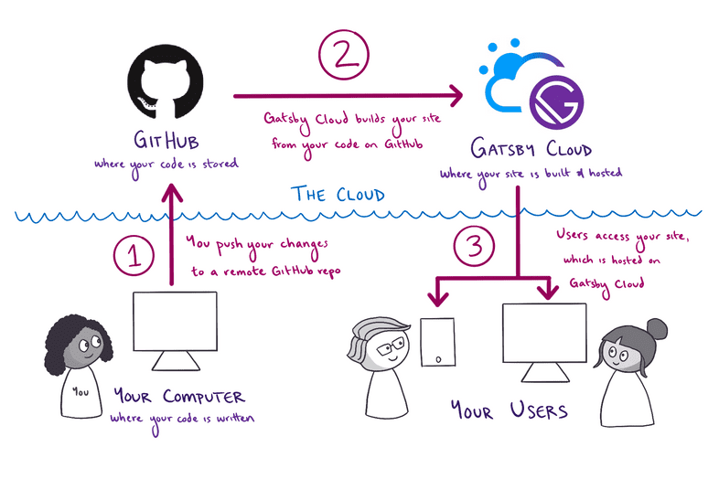
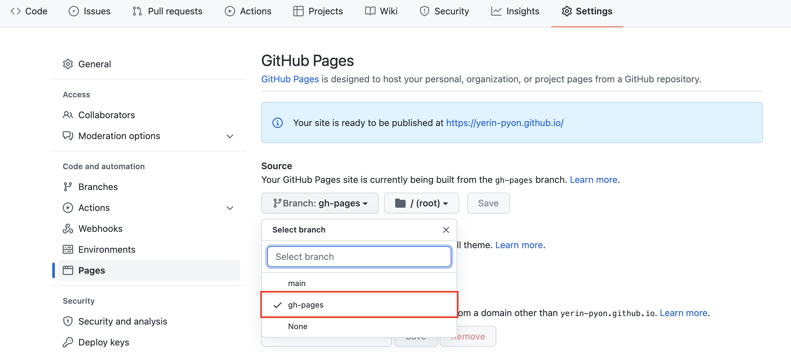

# Gatsby + github pages

_Related skills: React, graphQL, github, etc._

Gatsby is a React-based open-source framework for creating websites and apps. It's great whether you're building a portfolio site or blog, or a high-traffic e-commerce store or company homepage.



This diagram below shows a high-level view of how all the pieces of this process fit together.

## Installation

### Install node js

```bash
## install brew
% /usr/bin/ruby -e "$(curl -fsSL https://raw.githubusercontent.com/Homebrew/install/master/install)"

## check version
% brew -v
```

```bash
## install node
% brew install node

## check version
% node -v
% npm -v
```

The OS X changed the shell system from _bash_ to _zsh_ since High Sierra. If you met the linked error during installation, you can use the below command.

```bash
% sudo chown -R $(whoami) $(brew --prefix)/*
% brew link node
```

### Install Gatsby

```bash
## install gatsby
% npm install -g gatsby-cli

## check version
% gatsby --version
```

### Dev Run

```bash
% npm install # or yarn install
% gatsby develop
```

It normaly uses _8000 port_, but if another application already uses this port, it can be uploaded with others.

```
You can now view gatsby-starter-blog in the browser.
⠀
  http://localhost:8001/
⠀
View GraphiQL, an in-browser IDE, to explore your site's data and schema
⠀
  http://localhost:8001/___graphql
```

## Deploy with Github pages

### Install github pages cli

```bash
% npm install gh-pages --save-dev
```

Modify package.json

```json
{
  "scripts": {
    "deploy": "gatsby build && gh-pages -d public"
  }
}
```

To post or update anything, you can use this command.

```markdown
% npm run deploy
```

### Add git ignore

```ignore
# Logs
logs
*.log
npm-debug.log*
yarn-debug.log*
yarn-error.log*

# Runtime data
pids
*.pid
*.seed
*.pid.lock

# Directory for instrumented libs generated by jscoverage/JSCover
lib-cov

# Coverage directory used by tools like istanbul
coverage

# nyc test coverage
.nyc_output

# Grunt intermediate storage (http://gruntjs.com/creating-plugins#storing-task-files)
.grunt

# Bower dependency directory (https://bower.io/)
bower_components

# node-waf configuration
.lock-wscript

# Compiled binary addons (http://nodejs.org/api/addons.html)
build/Release

# Dependency directories
node_modules/
jspm_packages/

# Typescript v1 declaration files
typings/

# Optional npm cache directory
.npm

# Optional eslint cache
.eslintcache

# Optional REPL history
.node_repl_history

# Output of 'npm pack'
*.tgz

# dotenv environment variable files
.env*

# gatsby files
.cache/
public

# Mac files
.DS_Store

# Yarn
yarn-error.log
.pnp/
.pnp.js
# Yarn Integrity file
.yarn-integrity

```

### Publish

```bash
% git init
% git add .
% git commit -m "first commit"
% git branch -M main
% git remote add origin https://github.com/{userid}/{userid}.github.io.git
% git push -u origin main
```

### Change main branch to gh-pages

Finally, after changing the source branch to _gh-pages_, the personal blog is ready to deploy!



At the beginning, it might take a minute for publishing the website.

## Refs.

- Starter templates: [Gatsby Starters](https://www.gatsbyjs.com/starters/)
- [Tutorial](https://www.gatsbyjs.com/docs/tutorial/)
- [How Gatsby Works with Github pages](https://www.gatsbyjs.com/docs/how-to/previews-deploys-hosting/how-gatsby-works-with-github-pages/)
