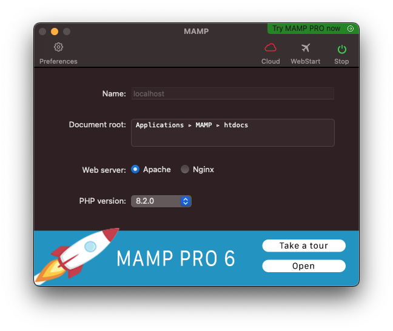
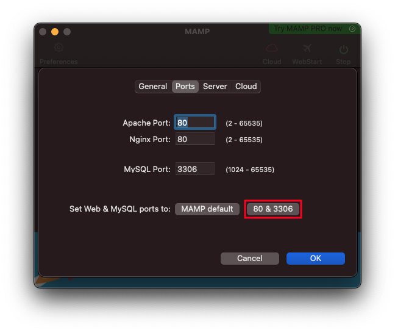
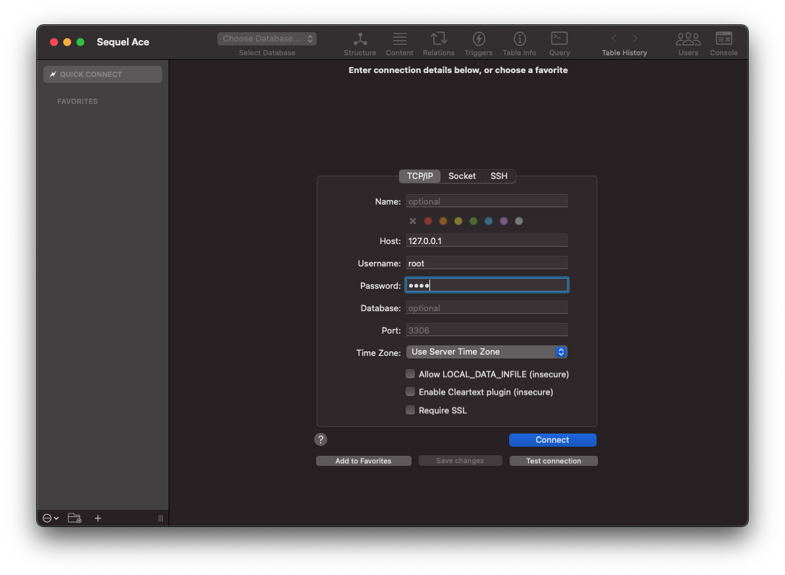
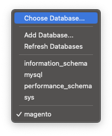
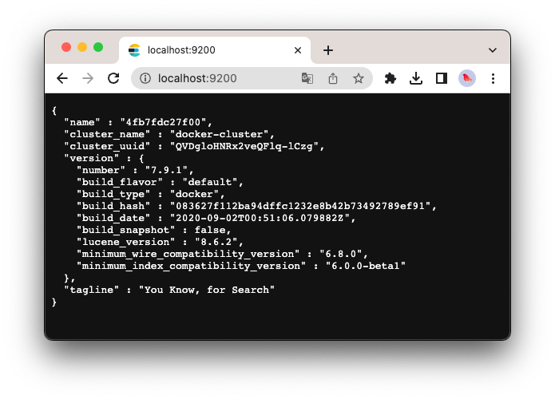
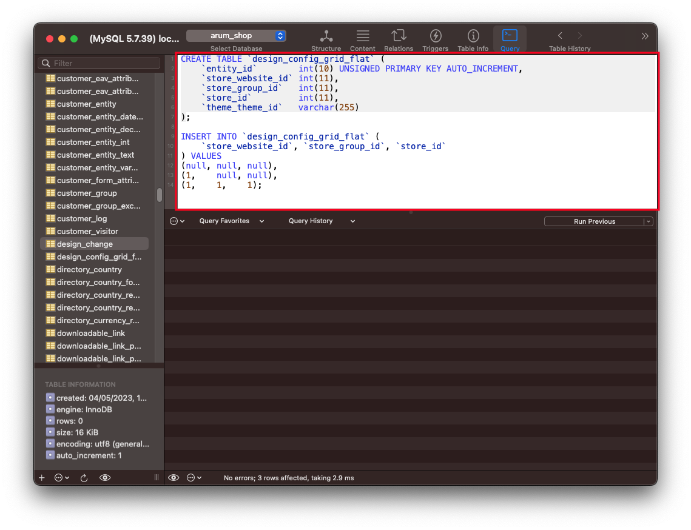
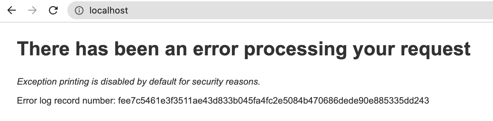
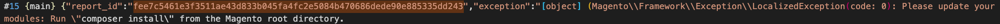

## Local Environment
1. Operating System
```
macOS Ventura 13.2.1
```

## Setup Magento with MAMP

### 1. Composer
```sh
$ brew install composer
$ composer -v
```

### 2. MAMP
1. Install MAMP  
[Download](https://www.mamp.info/en/downloads/)

2. Setup  



3. DB path
```
/Applications/MAMP/db/mysql57
```


### 3. Create Database
1. Connect to `127.0.0.1:3306`.


Note 1: User `127.0.0.1` instead of `localhost`.

Note 2: [MAMP](https://documentation-4.mamp.info/en/MAMP-PRO-Mac/How-Tos/MySQL/ConnectMySQLSequelPro/index.html) use `root` for the username and password as a default.

Create a database.


### 4. Search engine
#### 4-1. Install Elasticsearch docker
```sh
$ docker pull docker.elastic.co/elasticsearch/elasticsearch:7.9.1
$ docker run -d -p 9200:9200 -p 9300:9300 -e "discovery.type=single-node" --name elasticsearch docker.elastic.co/elasticsearch/elasticsearch:7.9.1
$ docker ps
CONTAINER ID   IMAGE                                                 COMMAND                  CREATED         STATUS         PORTS                                            NAMES
4fb7fdc27f00   docker.elastic.co/elasticsearch/elasticsearch:7.9.1   "/tini -- /usr/local…"   5 seconds ago   Up 4 seconds   0.0.0.0:9200->9200/tcp, 0.0.0.0:9300->9300/tcp   elasticsearch
```

You can check it with `localhost:9200`.  



#### 4-2. Install openresearch
```sh
$ brew install opensearch
$ brew services start opensearch
```

#### 4-3. Set search engine config
```sh
$ /Applications/MAMP/bin/php/php8.2.0/bin/php bin/magento setup:install --base-url=http://localhost/ --use-rewrites=1 --elasticsearch-host="localhost" --elasticsearch-port=9200
```


### 5. Setup Magento 2
Clone the existing project.  

```sh
$ composer install
```
   
#### 5-1. Download Magento   
```sh
$ composer create-project --repository=https://repo.magento.com/ magento/project-community-edition
```

#### 5-2. Change permission
```sh
$ chmod -Rf 777 var && chmod -Rf 777 pub/static && chmod -Rf 777 pub/media 
$ chmod 777 ./app/etc && chmod 644 ./app/etc/*.xml
$ chmod -Rf 755 bin
```

#### 5-3. Install with the existing code
```sh
$ /Applications/MAMP/bin/php/php8.2.0/bin/php -dmemory_limit=5G bin/magento setup:install --backend-frontname="admin" --db-host="localhost" --db-name="magento" --db-user="root" --db-password="root" --language="en_GB" --currency="GBP" --base-url=http://localhost/ --admin-user="admin" --admin-password="root@123" --admin-email="test@test.com" --admin-firstname="admin" --admin-lastname="user" --cleanup-database
$ /Applications/MAMP/bin/php/php8.2.0/bin/php bin/magento cache:clean
$ /Applications/MAMP/bin/php/php8.2.0/bin/php bin/magento s:s:d en_GB de_DE en_US fr_FR -f -j 4
```

`/Applications/MAMP/bin/php/php8.2.0/bin/php bin/magento setup:install --base-url=http://localhost/arumdentalshop --db-host=localhost --db-name=arum_shop --db-user=root --db-password=root --admin-firstname=Admin --admin-lastname=User --admin-email=dev@arum3d.com --admin-user=admin --admin-password=admin123 --language=en_GB --currency=GBP --timezone=Europe/London --use-rewrites=1 --backend-frontname="admin"`

#### 5-4. Errors
1. Couldn't find design_config_grid_flat table
```
In PatchApplier.php line 251:
                                                                                                                                                                                                                  
  Unable to apply patch Magento\InventorySales\Setup\Patch\Schema\InitializeWebsiteDefaultSock for module Magento_InventorySales. Original exception message: SQLSTATE[42S22]: Column not found: 1054 Unknown co  
  lumn 'theme_theme_id' in 'field list', query was: SELECT theme_theme_id  FROM design_config_grid_flat
```

Solution: https://magento.stackexchange.com/questions/202002/sqlstate42s02-base-table-or-view-not-found-design-config-grid-flat  



2. Mageplaza Stmp module
```
[Progress: 430 / 1792]
Module 'Mageplaza_Smtp':
Installing schema... 
In Config.php line 452:
                                           
  Invalid entity_type specified: customer  
                                           
```

Solution: https://github.com/mageplaza/magento-2-blog/issues/337#issuecomment-1140956455

3. Memory limit errors
```
Fatal error: Allowed memory size of 134217728 bytes exhausted (tried to allocate 1187840 bytes) in /Applications/MAMP/htdocs/arumdentalshop/vendor/magento/framework/Encryption/Adapter/SodiumChachaIetf.php on line 41

Check https://getcomposer.org/doc/articles/troubleshooting.md#memory-limit-errors for more info on how to handle out of memory errors.{"messages":{"error":[{"code":500,"message":"Server internal error. See details in report api\/1134478120890"}]}}%
```

Solution:
```sh
$ vi /Applications/MAMP/bin/php/php8.2.0/conf/php.ini
```

```ini
max_execution_time = 360
memory_limit = -1
upload_max_filesize = 1024M
short_open_tag = On
date.timezone = Europe/London
```


### 6. Magento 2 Deploy
```sh
/Applications/MAMP/bin/php/php8.2.0/bin/php -d memory_limit=4G bin/magento s:s:d en_GB de_DE en_US fr_FR -f -j 4
```

`/Applications/MAMP/bin/php/php8.2.0/bin/php bin/magento s:s:d en_GB de_DE en_US fr_FR -f -j 4`


### 7. Magento 2 CLI
```sh
$ /Applications/MAMP/bin/php/php8.2.0/bin/php bin/magento setup:di:compile
$ /Applications/MAMP/bin/php/php8.2.0/bin/php bin/magento setup:upgrade
$ /Applications/MAMP/bin/php/php8.2.0/bin/php bin/magento cache:clean
$ /Applications/MAMP/bin/php/php8.2.0/bin/php bin/magento cache:flush
$ /Applications/MAMP/bin/php/php8.2.0/bin/php bin/magento set:store-config:set --base-url="http://localhost/"
```

### 8. Debug

`var/log/debug.log` or `var/report/fee7c5461e3f3511ae43d833b045fa4fc2e5084b470686dede90e885335dd243`  



----
### Refs:
1. MAMP https://www.dckap.com/blog/how-to-install-magento-2-on-macbook/
2. https://getgrav.org/blog/macos-ventura-apache-multiple-php-versions
3. https://cloudkul.com/blog/how-to-install-magento-2-4-on-macos/
4. https://netcorecloud.com/tutorials/how-to-install-magento-on-ubuntu-18-04/
5. https://websitebeaver.com/set-up-localhost-on-macos-high-sierra-apache-mysql-and-php-7-with-sslhttps
6. Docker: https://www.linkedin.com/pulse/macbook-tutorial-guide-setup-magento-2-docker-mahesh-karekar/
