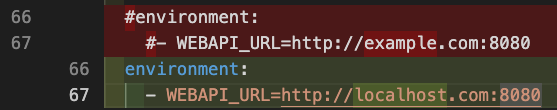
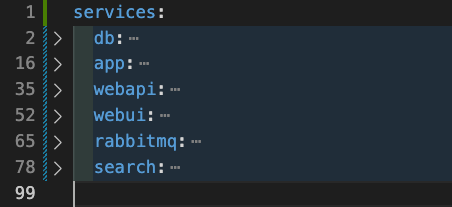

# 1. Install Docker on Mac Sillicon 

## 1.1 Install rosetta 

```sh
➜  metasfresh-docker git:(master) ✗ softwareupdate --install-rosetta
I have read and agree to the terms of the software license agreement. A list of Apple SLAs may be found here: http://www.apple.com/legal/sla/
Type A and press return to agree: A
2023-03-15 13:05:43.814 softwareupdate[4302:22718724] Package Authoring Error: 032-48321: Package reference com.apple.pkg.RosettaUpdateAuto is missing installKBytes attribute
Install of Rosetta 2 finished successfully
```

## 1.2 [Install Docker Desktop](https://docs.docker.com/desktop/install/mac-install/#install-interactively)

Once you install Docker Desktop, you could skip installing docker engine, compose, etc.


# 2. Install metasfresh

## 2.1 Clone repository

```sh
git clone https://github.com/metasfresh/metasfresh-docker.git
cd metasfresh-docker/
```

## 2.2 Change Webapi url to localhost


## 2.3 Create the Docker containers.

Docker compose version 1 is no longer considered, but this `docker-compose.yml` file is based on the version 1. So if you try to use the default version (version 2), you may meet the below error:

```sh
➜  metasfresh-docker git:(master) ✗ docker-compose build
(root) Additional property db is not allowed
```

Then there are two options to workaround this.

1. Using compose v1 explicitly on terminal.

```sh
➜  metasfresh-docker git:(master) ✗ docker-compose-v1 build
Building db
[+] Building 20.7s (7/7) FINISHED
...
Building rabbitmq
[+] Building 14.9s (5/5) FINISHED
...
Building search
[+] Building 47.2s (8/8) FINISHED
...
Building app
[+] Building 81.8s (9/9) FINISHED
...
Building webapi
[+] Building 19.6s (9/9) FINISHED
...
Building webui
[+] Building 9.5s (14/14) FINISHED
```

1. Or change docker-compose.yml like the below


```sh
➜  metasfresh-docker git:(master) ✗ docker-compose build    
[+] Building 0.0s (0/0)
[+] Building 0.0s (0/0)
[+] Building 0.1s (1/1)
...
[+] Building 1.2s (14/14) FINISHED
```

## 2.4 


TBC...

Refs:
- [How to set up the metasfresh stack using Docker](https://docs.metasfresh.org/installation_collection/EN/How_do_I_setup_the_metasfresh_stack_using_Docker)
