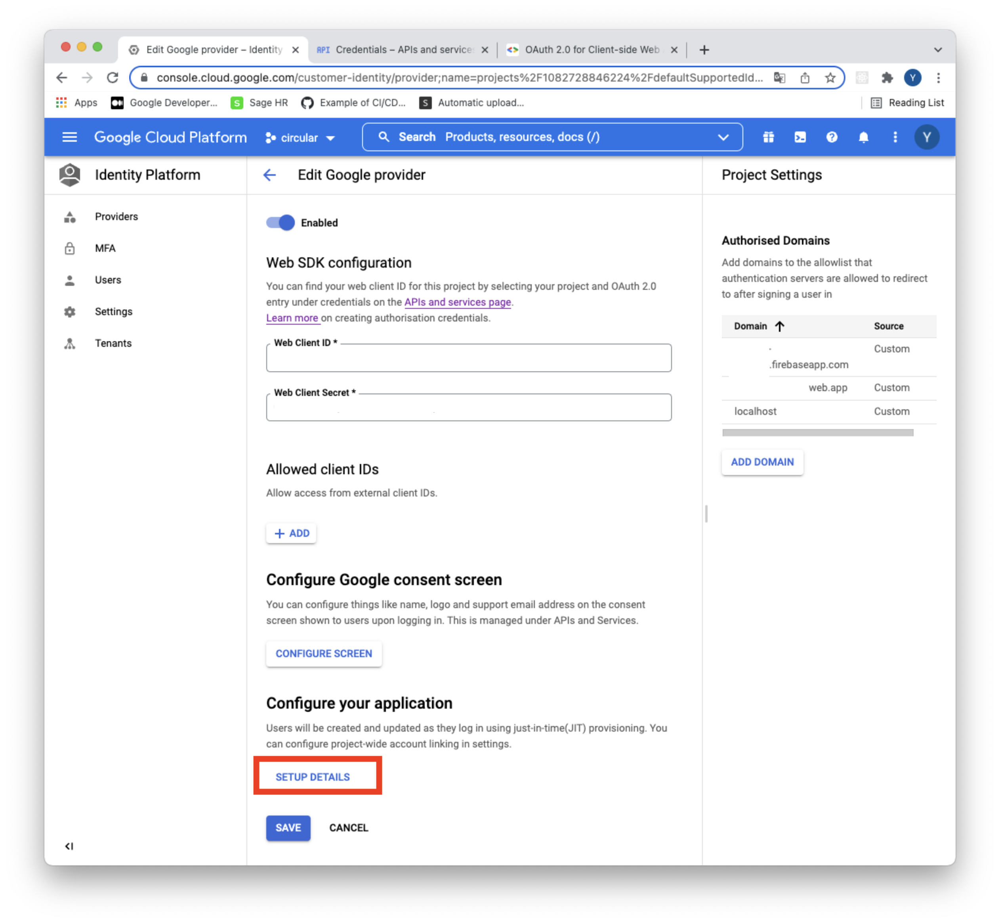
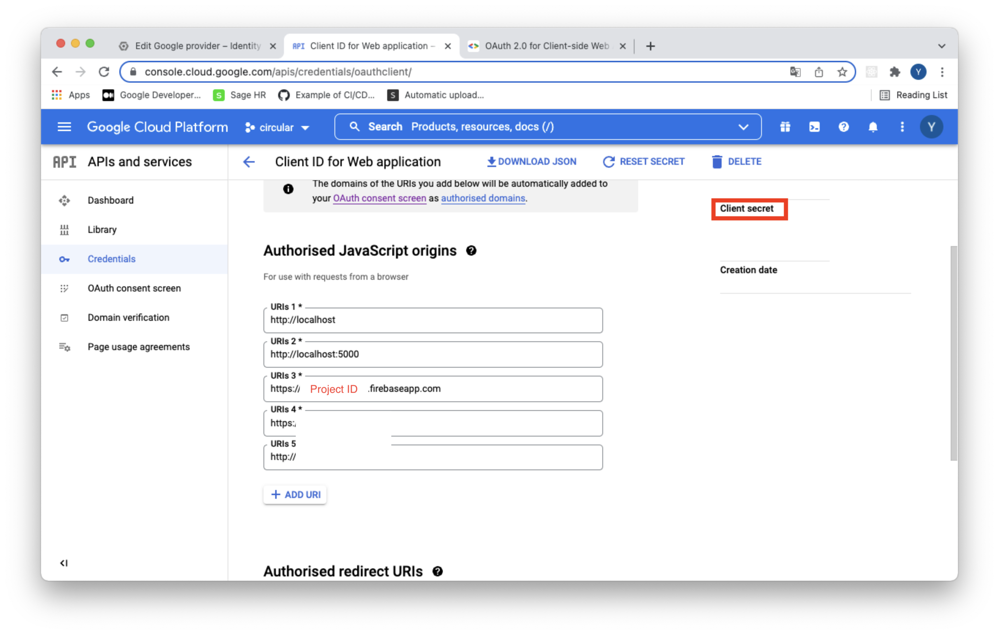

# Implement Google SSO

## Setup GCP

GCP - Identity Platform is basically a Firebase service. But it's still had a same usage via Firebase.







## React

```bash
yarn add firebase
```

1. Firebase service
firebase.jsx
```javascript
import firebase from 'firebase/compat/app';
import 'firebase/compat/auth';

const firebaseConfig = {
  apiKey: '',
  authDomain: 'PROJECT_ID.firebaseapp.com',
  databaseURL: 'https://PROJECT_ID.firebaseapp.com',
  storageBucket: 'PROJECT_ID.appspot.com',
  projectId: 'PROJECT_ID',
};

firebase.initializeApp(firebaseConfig);

export const auth = firebase.auth();

const provider = new firebase.auth.GoogleAuthProvider();
provider.setCustomParameters({ prompt: 'select_account' });

export const signInWithGoogle = () => auth.signInWithPopup(provider);
export const signOutWithGoogle = () => auth.signOut();

export default firebase;
```

If you could meet the below error, you probably use firebase version 9 but import version 8.
```shell
warn  in ./assets/js/services/firebase.jsx                                       14:37:34

export 'default' (imported as 'firebase') was not found in 'firebase/app' (possible exports: FirebaseError, SDK_VERSION, _DEFAULT_ENTRY_NAME, _addComponent, _addOrOverwriteComponent, _apps, _clearComponents, _components, _getProvider, _registerComponent, _removeServiceInstance, deleteApp, getApp, getApps, initializeApp, onLog, registerVersion, setLogLevel)

Entrypoint app [big] 10 MiB = runtime.js 18.6 KiB vendors-node_modules_mui_icons-material_AccountBalance_js-node_modules_mui_icons-material_Ass-eaa7ca.js 9.87 MiB app.css 386 bytes app.js 141 KiB
webpack compiled with 4 warnings
✨  Done in 14.98s.
```

So you can simply fix this error using `import firebase form 'firebase/compat/app'` instead of `import firebase from 'firebase/app'`, and `import 'firebase/app'` instead of `import 'firebase/auth'`.


2. UserAvatar.jsx

```javascript
import * as React from 'react';
import {
  Avatar,
  Box,
  IconButton,
  Menu,
  MenuItem,
  Tooltip,
  Typography,
} from '@mui/material';
import firebase, {
  signInWithGoogle,
  signOutWithGoogle,
} from '@PROJECT/services/firebase';

function UserAvatar() {
  const [anchorElUser, setAnchorElUser] = React.useState(null);
  const [user, setUser] = React.useState(null);

  React.useEffect(() => {
    firebase.auth().onAuthStateChanged((firebaseUser) => {
      setUser(firebaseUser);
    });
  }, []);

  const handleOpenUserMenu = (event) => {
    setAnchorElUser(event.currentTarget);
  };

  const handleCloseUserMenu = () => {
    setAnchorElUser(null);
  };

  const handleProfile = () => {
    setAnchorElUser(null);
  };

  const handleLogIn = () => {
    signInWithGoogle();
  };

  const handleLogOut = () => {
    signOutWithGoogle();
    setAnchorElUser(null);
  };

  const settings = [
    {
      name: 'Profile',
      action: handleProfile,
    },
    {
      name: 'LogOut',
      action: handleLogOut,
    },
  ];

  return (
    <Box sx={{ flexGrow: 0 }}>
      <Tooltip title="Open settings">
        <IconButton onClick={user ? handleOpenUserMenu : handleLogIn} sx={{ p: 0 }}>
          {user
            ? <Avatar alt={user.photoURL} src={user.photoURL} />
            : <Avatar />}
        </IconButton>
      </Tooltip>
      <Menu
        sx={{ mt: '45px' }}
        id="menu-appbar"
        anchorEl={anchorElUser}
        anchorOrigin={{
          vertical: 'top',
          horizontal: 'right',
        }}
        keepMounted
        transformOrigin={{
          vertical: 'top',
          horizontal: 'right',
        }}
        open={Boolean(anchorElUser)}
        onClose={handleCloseUserMenu}
      >
        {settings.map((setting) => (
          <MenuItem key={setting.name} onClick={setting.action}>
            <Typography textAlign="center">{setting.name}</Typography>
          </MenuItem>
        ))}
      </Menu>
    </Box>
  );
}

export default UserAvatar;
```
