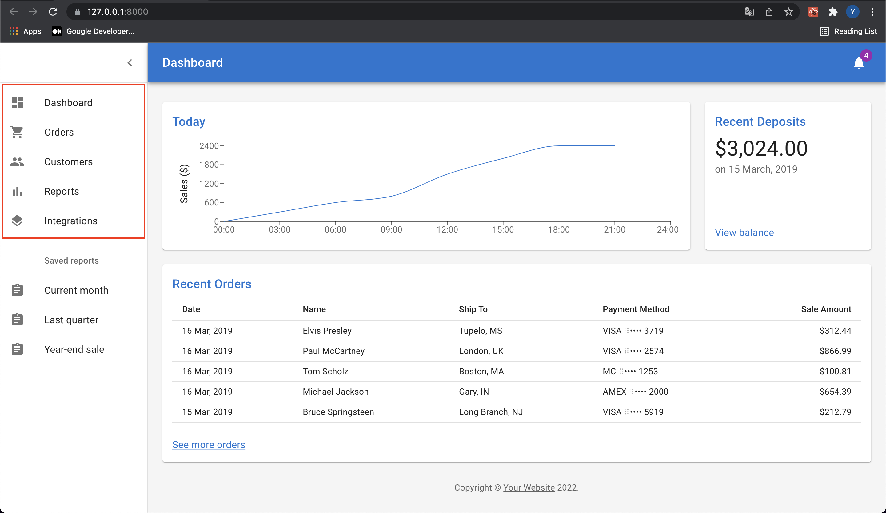
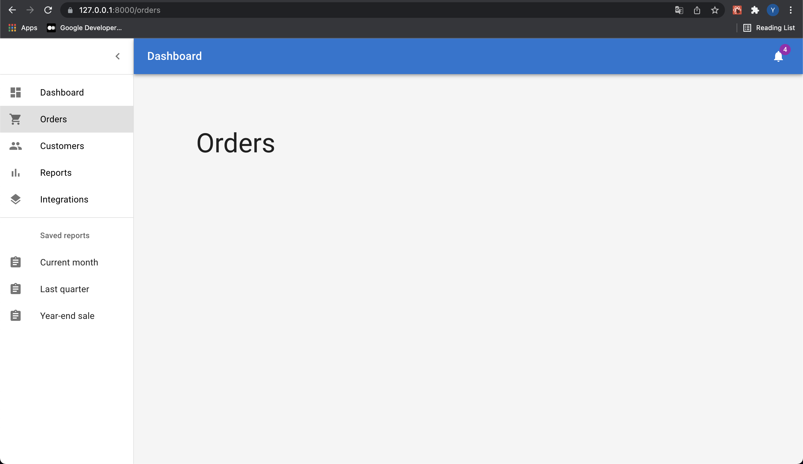

## Material UI

MUI, the material UI, to unify React and Material Design, is based on the material design which is a design system created by Google.

### Install mui package

- [mui for react](https://mui.com/getting-started/installation/)

```bash
yarn add @mui/material @mui/icons-material @emotion/react @emotion/styled
```

And, there we're!

## Practice with the mui dashboard example

We've simply installed the mui packages using yarn. And there are some templates on [the mui site](https://mui.com/getting-started/templates/). You can practice with these examples, and me, I'm going to use and improve [this dashboard one](https://mui.com/getting-started/templates/dashboard/).

I think you've noticed that the dashboard routhing doesn't work if you visit that demo site. So at this time, I'll implement the routing for this react app.

### Checkout the template code

Here is the [Dashboard souce](https://github.com/mui/material-ui/tree/master/docs/data/material/getting-started/templates/dashboard).

  
Let's implement these 5 tab pages inside the red box.

1. Refactoring listItems.js

First at all, let's have a look the listItems.js file. It looks quite good to use for listing pages together. Then, I created 4 pages under the `pages` directories which I created as well; OrdersPage, CustomersPage, ReportsPage, IntegrationsPage.

```javascript
import * as React from 'react'
import { Box, Container, CssBaseline, Typography } from '@mui/material'
import { createTheme, ThemeProvider } from '@mui/material/styles'

const mdTheme = createTheme()

const OrdersPage = () => {
  return (
    <ThemeProvider theme={mdTheme}>
      <Box sx={{ display: 'flex' }}>
        <CssBaseline />
        <Box
          sx={{
            backgroundColor: theme =>
              theme.palette.mode === 'light'
                ? theme.palette.grey[100]
                : theme.palette.grey[900],
            flexGrow: 1,
            height: '100vh',
            width: '180vh',
            overflow: 'auto',
          }}
        >
          <Container maxWidth="lg" sx={{ mt: 20, mb: 4 }}>
            <Typography component="h1" variant="h3">
              Orders
            </Typography>
          </Container>
        </Box>
      </Box>
    </ThemeProvider>
  )
}

export default OrdersPage
```

```javascript
import * as React from 'react';
import { Link } from 'react-router-dom';

...

import Dashboard from './Dashboard';
import OrdersPage from './OrdersPage';
import CustomersPage from './CustomersPage'
import ReportsPage from './ReportsPage';
import IntegrationsPage from './IntegrationsPage';

export const mainPages = [
  {
      text: 'Dashboard',
      icon: <DashboardIcon />,
      link: '/',
      page: <Dashboard />
  },
  {
      text: 'Orders',
      icon: <ShoppingCartIcon />,
      link: '/orders',
      page: <OrdersPage />
  },
  {
      text: 'Customers',
      icon: <PeopleIcon />,
      link: '/customers',
      page: <CustomersPage />
  },
  {
      text: 'Reports',
      icon: <BarChartIcon />,
      link: '/reports',
      page: <ReportsPage />
  },
  {
      text: 'Integrations',
      icon: <LayersIcon />,
      link: '/integrations',
      page: <IntegrationsPage />
  },
];

const ListItemsBuilder = (items) => {
  return (
    <React.Fragment>
      {items.map(
        (item, i) => (
          <Link
            style={{ textDecoration: 'none', color: 'black' }}
            to={item.link}
            key={item.text}>
            <ListItemButton>
              <ListItemIcon>{item.icon}</ListItemIcon>
              <ListItemText primary={item.text} />
            </ListItemButton>
          </Link>
        )
      )}
    </React.Fragment>
  );
}

export const MainListItems = () => {
  const list = ListItemsBuilder(mainPages);
  return (
    <>{list}</>
  );
}
```

To reduce some duplications, I defined a `mainPages` list, created a builder function, and exported MainListItems for a drawer.

Yet refresh the web, the routing didn't work properly.

2. Create Router

```javascript
import * as React from 'react'
import { BrowserRouter, Routes, Route } from 'react-router-dom'

import { mainPages } from '../pages/PageList'

const MyRouterBuilder = items => {
  return (
    <BrowserRouter>
      <Routes>
        {items.map(item => (
          <Route path={item.link} element={item.page} key={item.text} />
        ))}
      </Routes>
    </BrowserRouter>
  )
}

const MyRouter = () => {
  const router = MyRouterBuilder(mainPages)
  return <>{router}</>
}

export default MyRouter
```

From react router v6, [`Switch` is upgraded to `Routes`](https://reactrouter.com/docs/en/v6/upgrading/v5#upgrade-all-switch-elements-to-routes). So if you use the version 5, you might use `Switch` instead of `Routes`.

I want to keep the appbar and the drawer, to change only the body, I'm going to define the navigation.

```javascript
import * as React from 'react'

import { styled } from '@mui/material/styles'
import MuiAppBar from '@mui/material/AppBar'
import Divider from '@mui/material/Divider'
import MuiDrawer from '@mui/material/Drawer'
import IconButton from '@mui/material/IconButton'
import List from '@mui/material/List'
import Toolbar from '@mui/material/Toolbar'
import Typography from '@mui/material/Typography'
import MenuIcon from '@mui/icons-material/Menu'
import ChevronLeftIcon from '@mui/icons-material/ChevronLeft'

import { MainListItems, secondaryListItems } from '../pages/PageList'

const drawerWidth = 240

const AppBar = styled(MuiAppBar, {
  shouldForwardProp: prop => prop !== 'open',
})(({ theme, open }) => ({
  zIndex: theme.zIndex.drawer + 1,
  transition: theme.transitions.create(['width', 'margin'], {
    easing: theme.transitions.easing.sharp,
    duration: theme.transitions.duration.leavingScreen,
  }),
  ...(open && {
    marginLeft: drawerWidth,
    width: `calc(100% - ${drawerWidth}px)`,
    transition: theme.transitions.create(['width', 'margin'], {
      easing: theme.transitions.easing.sharp,
      duration: theme.transitions.duration.enteringScreen,
    }),
  }),
}))

const Drawer = styled(MuiDrawer, {
  shouldForwardProp: prop => prop !== 'open',
})(({ theme, open }) => ({
  '& .MuiDrawer-paper': {
    position: 'relative',
    whiteSpace: 'nowrap',
    width: drawerWidth,
    transition: theme.transitions.create('width', {
      easing: theme.transitions.easing.sharp,
      duration: theme.transitions.duration.enteringScreen,
    }),
    boxSizing: 'border-box',
    ...(!open && {
      overflowX: 'hidden',
      transition: theme.transitions.create('width', {
        easing: theme.transitions.easing.sharp,
        duration: theme.transitions.duration.leavingScreen,
      }),
      width: theme.spacing(7),
      [theme.breakpoints.up('sm')]: {
        width: theme.spacing(9),
      },
    }),
  },
}))

function NavigatorContent() {
  const [open, setOpen] = React.useState(true)
  const toggleDrawer = () => {
    setOpen(!open)
  }

  return (
    <ThemeProvider theme={mdTheme}>
      <Box sx={{ display: 'flex' }}>
        <CssBaseline />
        <AppBar position="absolute" open={open}>
          <Toolbar
            sx={{
              pr: '24px', // keep right padding when drawer closed
            }}
          >
            <IconButton
              edge="start"
              color="inherit"
              aria-label="open drawer"
              onClick={toggleDrawer}
              sx={{
                marginRight: '36px',
                ...(open && { display: 'none' }),
              }}
            >
              <MenuIcon />
            </IconButton>
            <Typography
              component="h1"
              variant="h6"
              color="inherit"
              noWrap
              sx={{ flexGrow: 1 }}
            >
              Dashboard
            </Typography>
            <IconButton color="inherit">
              <Badge badgeContent={4} color="secondary">
                <NotificationsIcon />
              </Badge>
            </IconButton>
          </Toolbar>
        </AppBar>
        <Drawer variant="permanent" open={open}>
          <Toolbar
            sx={{
              display: 'flex',
              alignItems: 'center',
              justifyContent: 'flex-end',
              px: [1],
            }}
          >
            <IconButton onClick={toggleDrawer}>
              <ChevronLeftIcon />
            </IconButton>
          </Toolbar>
          <Divider />
          <List component="nav">
            <MainListItems />
            <Divider sx={{ my: 1 }} />
            {secondaryListItems}
          </List>
        </Drawer>
      </Box>
    </ThemeProvider>
  )
}

export default function Navigation() {
  return <NavigatorContent />
}
```

Just creating a `Navigation.js` file and copy the appbar and the drawer section in `Dashboard.js` file. And let's add this navigation in the router.

```javascript
...
import Navigation from './Navigation';
import { mainPages } from '../pages/PageList'

const MyRouterBuilder = (items) => {
  return (
    <BrowserRouter>
      <Navigation />
      <Routes>
...
```

Add the `Navigation` component in your router. Keep in mind that any navigation is located on the same hierarchy with `Routes`.

## Result!


