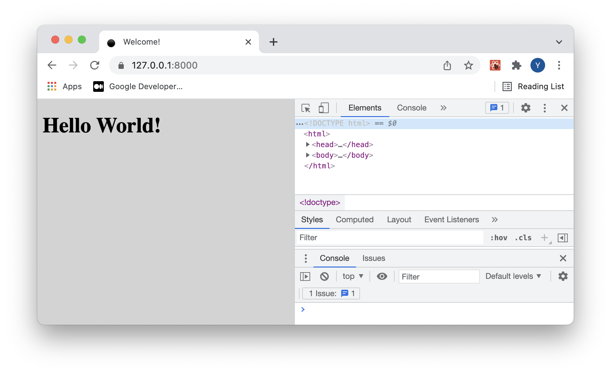

# Symfony

Symfony is an Open Source distributed PHP framework for Web Application. And this framework simplifies developments, so you can work faster and more effectively.

## Setup Symfony

#### 1. Install Symfony CLI

```bash
brew install symfony-cli/tap/symfony-cli
```

#### 2. Create a new symfony project

```bash
symfony new --webapp PROJECT_NAME
```

#### 3. Install Composer

```bash
php -r "copy('https://getcomposer.org/installer', 'composer-setup.php');"
php -r "if (hash_file('sha384', 'composer-setup.php') === '906a84df04cea2aa72f40b5f787e49f22d4c2f19492ac310e8cba5b96ac8b64115ac402c8cd292b8a03482574915d1a8') { echo 'Installer verified'; } else { echo 'Installer corrupt'; unlink('composer-setup.php'); } echo PHP_EOL;"
php composer-setup.php
# Or If you want to put in the project bin, use the below command.
# php composer-setup.php --install-dir=bin --filename=composer # related dir: PROJECT/bin/composer
php -r "unlink('composer-setup.php');"
```

If you want to set as global, please run the below command. ([composer intro](https://getcomposer.org/doc/00-intro.md#globally))

```shell
mv composer.phar /usr/local/bin/composer
```

# Webpack Encore

Webpack Encore is a simpler way to integrate Webpack into your application. It wraps Webpack, giving you a clean & powerful API for bundling JavaScript modules, pre-processing CSS & JS and compiling and minifying assets. Encore gives you professional asset system that's a delight to use.

#### 1. Install Encore in Symfony webapp

```bash
composer require symfony/webpack-encore-bundle
yarn install
# npm install # If you don't use yarn, use npm.
```

# Create the first page using React

#### 1. Install React

```bash
yarn add react react-dom prop-types
yarn add @babel/preset-react@^7.0.0 --dev
```

#### 2. Create js and css directories.

After installing encore webpack, assets directory is created into the project root. We are going to use react framework, so some are deleted.

##### Before

```markdown
assets
├── app.js
├── bootstrap.js
├── controllers
│ └── hello_controller.js
├── controllers.json
└── styles
└── app.css
```

##### After

```markdown
assets
├── css
│ └── app.css
└── js
└── app.js
```

#### 3. Rendering javascript to base.html.twig

##### assets/app.js

```javascript
import '../css/app.css'

import * as React from 'react'
import ReactDOM from 'react-dom'

function Hello() {
  return <h1>Hello World!</h1>
}

ReactDOM.render(<Hello />, document.getElementById('root'))
```

##### templates/base.html.twig

```twig
<!DOCTYPE html>
<html>
    <head>
        <meta charset="UTF-8">
        <title>Welcome!</title>
        <link rel="icon" href="data:image/svg+xml,<svg xmlns=%22http://www.w3.org/2000/svg%22 viewBox=%220 0 128 128%22><text y=%221.2em%22 font-size=%2296%22>⚫️</text></svg>">
        {# Run `composer require symfony/webpack-encore-bundle` to start using Symfony UX #}
        
            {{ encore_entry_link_tags('app') }}
        

        
            {{ encore_entry_script_tags('app') }}
        
    </head>
    <body>
        
            <div id="root"></div>
        
    </body>
</html>
```

##### src/Controller/IndexController.php

```php
<?php

namespace App\Controller;

use Symfony\Bundle\FrameworkBundle\Controller\AbstractController;
use Symfony\Component\HttpFoundation\Response;
use Symfony\Component\Routing\Annotation\Route;

class IndexController extends AbstractController
{
    /**
     * @Route("/")
     * @return Response
     */
    public function index(): Response
    {
        return $this->render('base.html.twig', []);
    }
}
```

##### config/routes.yaml

```yaml
index:
  path: /
  controller: App\Controller\IndexController::index
```

#### 4. Set the configuration file.

##### webpack.config.js

```javascript
const Encore = require('@symfony/webpack-encore')

// Manually configure the runtime environment if not already configured yet by the "encore" command.
// It's useful when you use tools that rely on webpack.config.js file.
if (!Encore.isRuntimeEnvironmentConfigured()) {
  Encore.configureRuntimeEnvironment(process.env.NODE_ENV || 'dev')
}

Encore.setOutputPath('public/build/')
  .setPublicPath('/build')

  .addEntry('app', './assets/js/app.js')

  .splitEntryChunks()

  .enableSingleRuntimeChunk()

  .cleanupOutputBeforeBuild()
  .enableBuildNotifications()
  .enableSourceMaps(!Encore.isProduction())
  .enableVersioning(Encore.isProduction())

  .configureBabel(config => {
    config.plugins.push('@babel/plugin-proposal-class-properties')
  })

  .configureBabelPresetEnv(config => {
    config.useBuiltIns = 'usage'
    config.corejs = 3
  })

  .enableReactPreset()

module.exports = Encore.getWebpackConfig()
```

#### 5. Build!

```bash
yarn dev
symfony server:start
```

### c.f.1) Error

```
In FileLoader.php line 173:

  Bundle "WebProfilerBundle" does not exist or it is not enabled. Maybe you forgot to add it in the "registerBundles()" method of your "App\Kernel.php" file? in @WebProfilerBundle/Res
  ources/config/routing/wdt.xml (which is being imported from "C:\Users\user\Desktop\SylviaTest\config/routes/dev/web_profiler.yaml"). Make sure the "WebProfilerBundle/Resources/confi
  g/routing/wdt.xml" bundle is correctly registered and loaded in the application kernel class. If the bundle is registered, make sure the bundle path "@WebProfilerBundle/Resources/co
  nfig/routing/wdt.xml" is not empty.


In Kernel.php line 226:

  Bundle "WebProfilerBundle" does not exist or it is not enabled. Maybe you forgot to add it in the "registerBundles()" method of your "App\Kernel.php" file?
```

[Stack overflow](https://stackoverflow.com/questions/63448777/symfony-5-bundle-webprofilerbundle-does-not-exist-or-it-is-not-enabled)

I've simply removed `config/routes/dev`.

## Done!



## Refs.

- [Symfony installation](https://symfony.com/doc/current/setup.html)
- [Symfony CLI](https://symfony.com/download)
